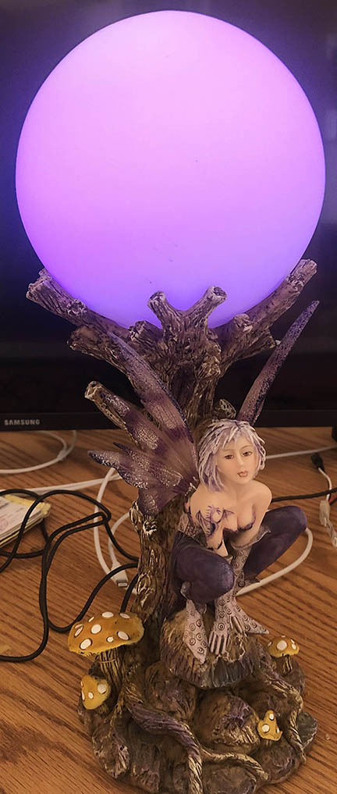

# fairy-lamp
Circuit-python code for fairy-lamp re-do

 

## Overview
I was cleaning out my home office and throwing away a bunch of junk. This lamp was literally in my hand over the trash bin and my daughter (6 years old at the time) gasped and asked me if she could have it. I was itching to do another "LED project," so I said, "Sure... gimme a couple of days." 

## Features
I knew I wanted the lamp to have two modes. One was a normal "desk lamp" and the other was "nightlight mode." I knew I wanted to do a capactive switch to toggle between modes. I also knew I wanted to have a toggle "on/off" switch. I used bare copper wire under the large mushroom to the fairy's left for the mode toggle, and hid the on/off switch to her right.

## Materials
* Adafruit trinket M0: https://www.adafruit.com/product/3500
* Adafruit NeoPixel Jewel: https://www.adafruit.com/product/2226
* Misc toggle switch
* Generic AC to 5vDC "wall wart" plug
